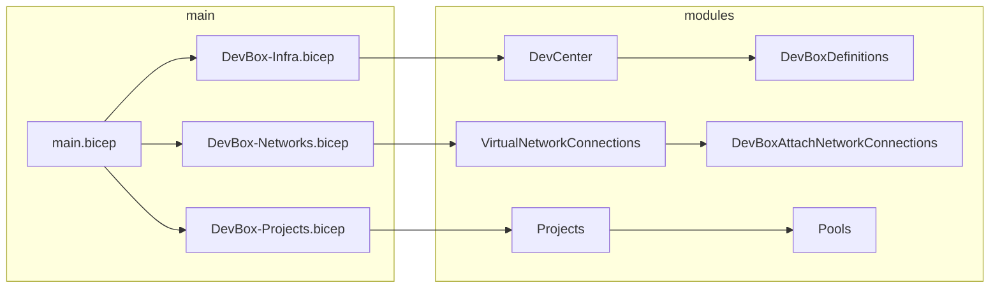

# Azure Dev Box 

This example deploys Azure Dev Box (Dev Center) based on existing VNET's, multiple projects and multiple pools and uses the builtin image gallery of Dev Center to deploy Dev Boxes.

## Deployment flow



## Parameters

### general parameters

```bicep
param subscriptionID = '<your subscription id>' // Subscription where Dev Center will be deployed
param DevCenterName = '<Dev Center Name>'
param resourceGroupName = '<Resource group name>' // Resource group name used to deply Dev Center, Definitions, Projects, Pools and Network Connections
```

### Networks parameter block

This is an array of Networks (Subnets) to be linked (attached) to Dev Center

```bicep
param networks = [ // include each VNET Subnet ID where you want to deploy Dev Boxes.
  {
    name: '<Network Connection name used by Dev Center>'
    location: 'WestEurope'
    subnetID: '/subscriptions/<your subscription id>/resourceGroups/<your resource group name>/providers/Microsoft.Network/virtualNetworks/<your VNET name>/subnets/<Subnet name>'
  }
]
```

- *note1: each Network Connection will be deployed in a separate resource group within the same **subscription** and **location** of the VNET.*
- *note2: a new resource group will be created and named as defined in parameter: **resourceGroupName**.*

### Projects parameter block

```bicep
param projects = [
  {
    name: '<Dev Center Project Name>'
    description: '<Project description>'
    pools: [ // Define multiple Pools and link them to Network Connection and Image Definition
      {
        name: '<Pool Name>'
        definitionName: '<Image Definition name. must be the same name as in Definition parameter block>'
        networkConnectionName: '<Network Connection name. Must be the same nam as in Networks parameter block>'
        localAdministrator: 'Enabled' // Enable or Disabled
        stopOnDisconnect: 'Enabled' // Enable or Disabled
        gracePeriodMinutes: 60 // Minimal 60
      }
    ]
    roleAssignments: [ // Role Assignments will be set on Project. Can have one or multiple role assignments
      {
        roleID: '331c37c6-af14-46d9-b9f4-e1909e1b95a0' // DevCenter Project Admin
        principalID: '<Object ID of AD user, group or Service Principal>'
        principalType: 'User' // User or Group or ServicePrincipal
      }
      {
        roleID: '45d50f46-0b78-4001-a660-4198cbe8cd05' // DevCenter DevBox User
        principalID: '<Object ID of AD user, group or Service Principal>'
        principalType: 'User' // User or Group or ServicePrincipal
      }
    ]
  }
]

```

### Definitions parameter block

```bicep
param definitions = [
  {
    name: 'W11'
    image: 'microsoftwindowsdesktop_windows-ent-cpc_win11-22h2-ent-cpc-os'
    diskSize: 'ssd_1024gb'
    vmSKU: 'general_a_8c32gb_v1'
  }
  {
    name: 'W11_M365'
    image: 'microsoftwindowsdesktop_windows-ent-cpc_win11-22h2-ent-cpc-m365'
    diskSize: 'ssd_1024gb'
    vmSKU: 'general_a_8c32gb_v1'
  }
  {
    name: 'W11_M365_VS2022'
    image: 'microsoftvisualstudio_visualstudioplustools_vs-2022-ent-general-win11-m365-gen2'
    diskSize: 'ssd_1024gb'
    vmSKU: 'general_a_8c32gb_v1'
  }
]
```

## Supported VM Size

```text
VM Sku Size: 'general_a_8c32gb_v1'
```

## Supported Disk Sizes

```text
Disk Sizes: 'ssd_1024gb'
            'ssd_512gb'
            'ssd_256gb'
```

## Supported builtin images by Dev Box

```list
'microsoftwindowsdesktop_windows-ent-cpc_win11-21h2-ent-cpc-os'
'microsoftwindowsdesktop_windows-ent-cpc_win11-21h2-ent-cpc-m365'
'microsoftwindowsdesktop_windows-ent-cpc_win10-21h2-ent-cpc-os-g2'
'microsoftwindowsdesktop_windows-ent-cpc_win10-21h2-ent-cpc-m365-g2'
'microsoftwindowsdesktop_windows-ent-cpc_21h1-ent-cpc-os-g2'
'microsoftwindowsdesktop_windows-ent-cpc_21h1-ent-cpc-m365-g2'
'microsoftwindowsdesktop_windows-ent-cpc_20h2-ent-cpc-os-g2'
'microsoftwindowsdesktop_windows-ent-cpc_20h2-ent-cpc-m365-g2'
'microsoftwindowsdesktop_windows-ent-cpc_win11-22h2-ent-cpc-os'
'microsoftwindowsdesktop_windows-ent-cpc_win11-22h2-ent-cpc-m365'
'microsoftwindowsdesktop_windows-ent-cpc_win10-22h2-ent-cpc-os'
'microsoftwindowsdesktop_windows-ent-cpc_win10-22h2-ent-cpc-m365'
'microsoftvisualstudio_visualstudio2019plustools_vs-2019-ent-general-win11-m365-gen2'
'microsoftvisualstudio_visualstudio2019plustools_vs-2019-pro-general-win11-m365-gen2'
'microsoftvisualstudio_visualstudioplustools_vs-2022-ent-general-win11-m365-gen2'
'microsoftvisualstudio_visualstudioplustools_vs-2022-pro-general-win11-m365-gen2'
'microsoftvisualstudio_visualstudio2019plustools_vs-2019-ent-general-win10-m365-gen2'
'microsoftvisualstudio_visualstudio2019plustools_vs-2019-pro-general-win10-m365-gen2'
'microsoftvisualstudio_visualstudioplustools_vs-2022-ent-general-win10-m365-gen2'
'microsoftvisualstudio_visualstudioplustools_vs-2022-pro-general-win10-m365-gen2'
```
